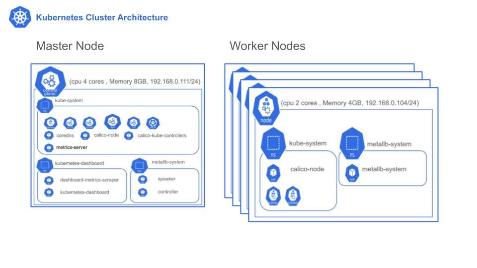
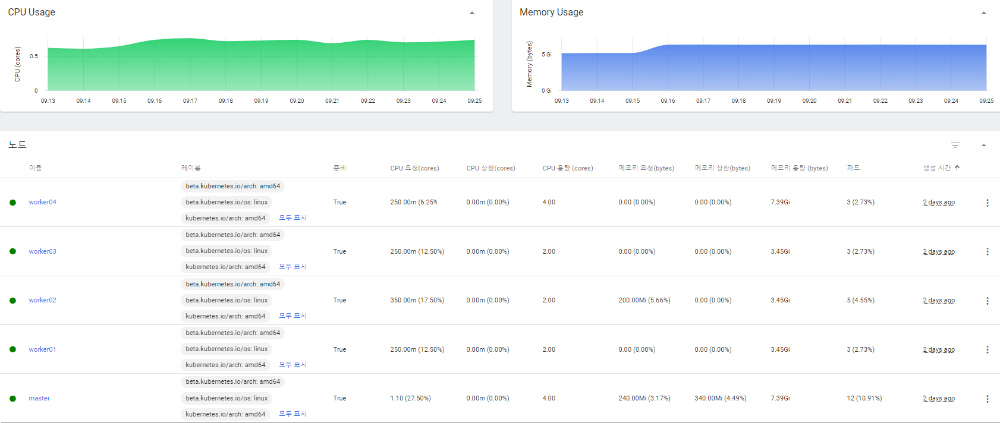
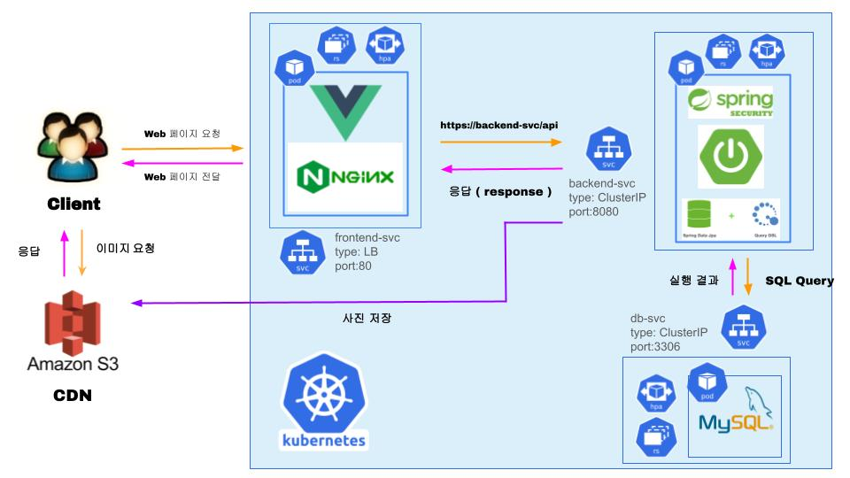
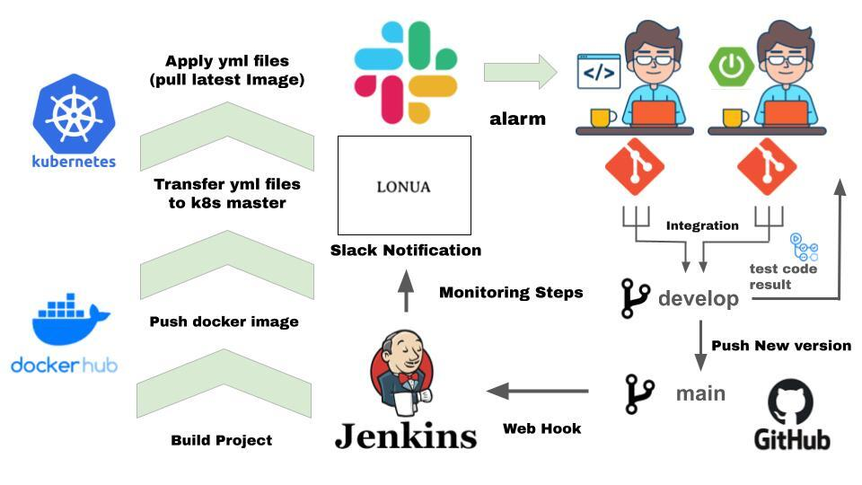
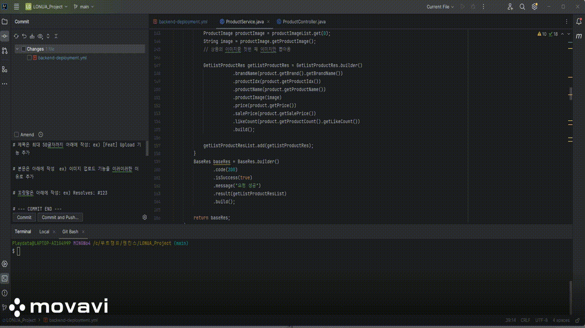
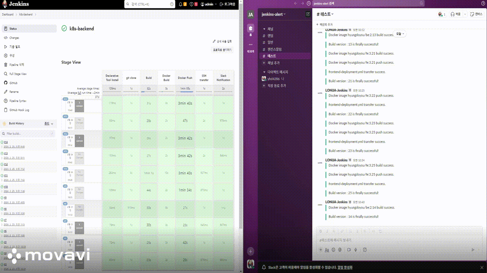
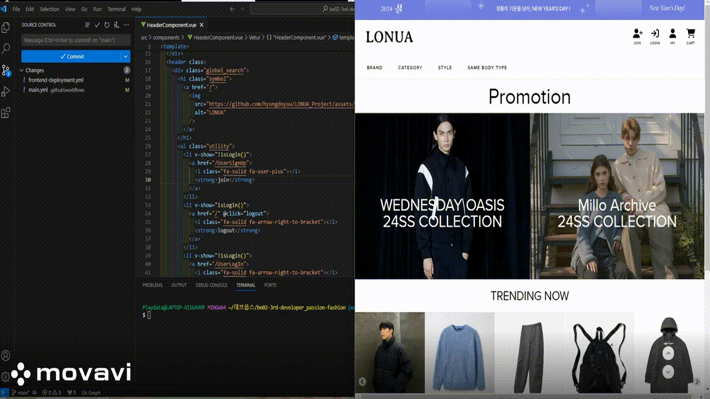
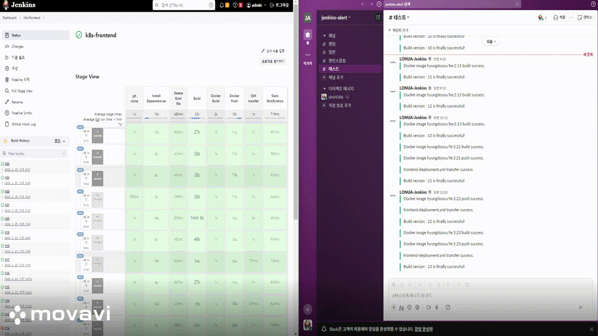

 

## 📌 기술 스택

&nbsp;&nbsp;&nbsp;&nbsp;</a></a>
&nbsp;&nbsp;&nbsp;&nbsp;</a></a>
&nbsp;&nbsp;&nbsp;&nbsp;</a></a>
&nbsp;&nbsp;&nbsp;&nbsp;</a></a>
&nbsp;&nbsp;&nbsp;&nbsp;</a></a>
&nbsp;&nbsp;&nbsp;&nbsp;</a></a>
&nbsp;&nbsp;&nbsp;&nbsp;</a></a>
&nbsp;&nbsp;&nbsp;&nbsp;</a></a>
&nbsp;&nbsp;&nbsp;&nbsp;</a></a>
 
 

---

## 🤳 프로젝트 목표

### Docker, k8s, Jenkins를 활용하여 기존에 만들었던 "Frontend" 와 "Backend" 프로젝트에

### CI/CD를 적용한다.

 

## CI/CD 의 필요성 ❓

### 🧐 기존 프로젝트 현황

- #### 팀원끼리 기능을 만든 후 통합하는 과정에서 충돌을 해결하고, 테스트하는 과정이 지속적으로 반복되다 보니,

#### &nbsp;&nbsp;&nbsp;　절차가 까다로워, 직접 웹페이지로 접속하여 기능을 테스트하거나, 포스트맨을 이용해 테스트를 하였다.

#### &nbsp;&nbsp;&nbsp;&nbsp;　 ➡ 따라서, 많은 시간과 비용이 발생하며, 다양한 케이스를 테스트할 수 없게 된다. ( CI의 필요성 대두 )

- #### 개발용 컴퓨터에서 직접 빌드를 하고 배포용 컴퓨터에 배포파일을 옮겨 배포

  #### ➡ 새로운 기능을 추가하거나, 에러를 수정할 때마다 배포과정을 반복한다. ( CD 필요성 대두 )

 

## CI/CD 의 기대효과 💥

- #### CI를 통해 애플리케이션 변경 사항이 자동으로 에러 테스트를 거치고, 깃허브 레포지토리에 업로드 됨으로써

#### &nbsp;&nbsp;&nbsp;　신뢰성 높은 환경을 구성 할 수 있고, 항시 배포 가능한 환경이 된다.

- #### CD는 개발자가 깃허브 레포지토리에 있는 애플리케이션을 수 분내에 지속적으로 배포함으로써,

#### &nbsp;&nbsp;&nbsp;　수동으로 배포할 때 보다 시간을 절약 할 수 있다.

   

---

## 🖥️ 운영 환경 : 쿠버네티스 & 컨테이너 운영 환경 구성

### 🧐 쿠버네티스를 이용한 이유

### ✅ 유연성

#### 쇼핑몰의 특성상 이벤트와 할인 행사에 따라 트래픽이 한번에 몰릴 수 있기 때문에, 트래픽 상황에 따라 유연하게

#### 대처할 수 있다는 장점이 있다.

 

### ✅ 장애 대처

#### "ReplicaSet" 을 통해, 장애가 발생한 파드를 자동으로 재실행하는 것이 가능하다.

#### 또한, HPA( Horizontal Pod Autoscaler)와 metrics를 활용하여, 각각의 파드의 부하 증가에 손쉽게 대처할 수 있다.

 

---

### 📁 &nbsp;&nbsp;k8s 클러스터 구성도

 

#### ✅ k8s 클러스터는 총 5대의 노드로 클러스터를 구성했다.

  
<b>노드 상세 정보(사진)</b>
 
       
  

- #### CNI는 "Calico" 를 통해서 구성하였으며, Calico를 선택한 이유는 대부분의 경우에 성능적으로 뛰어나다는 점

  #### 과 오픈 소스라는 점 2가지이다.

- #### Calico는 LoadBalancer Type의 서비스를 제공하지 않으므로, "metallb" 를 추가로 사용하게 되었다.

- #### "metrics" 는 HPA를 통한 Autoscaling 구현을 위해 사용한다.

 

<b>Pod 상세 설명</b>
  
 

### ✅ 각 Worker 노드에는 다음과 같은 파드가 공통적으로 생성된다.

> - **calico-node : 네트워크 정책을 관리하고 구성하는 역할**
>
> - **metalib-system : 클러스터 내에서 로드 밸런싱 및 외부 서비스 노출을 담당하는 역할**

 

### ✅ Master Node에는 다음과 같은 파드들이 추가된다.

> **kube-system Namespace**
>
> - **coredns : 클러스터 내에서 DNS 서버 역할**
> - **calico-kube-controllers : 클러스터 내에서 네트워크 정책을 관리하고 구성하는 역할**
> - **metrics-server : 클러스터 내에서 파드 및 노드의 리소스 사용량 및 성능 지표를 수집하고 노출하는 역할**

 

> **metailb-system Namespace**
>
> - **speaker : 외부 라우팅 장치와 통신하여 로드 밸런서에 할당된 IP 주소를 라우팅하는 역할**
> - **controller : 클러스터 내에서 IP 주소 범위를 관리하고, 외부 서비스에 IP 주소를 동적으로 할당하고** > &nbsp;　　　　　**회수하는 역할**

 
 

---

## 💡&nbsp;&nbsp;시스템 아키텍처

 

 

- #### 프론트엔드, 백엔드 각각의 디플로이먼트를 통해 파드로 생성된다.
- #### 사용자들은 LB (LoadBalancer) 타입의 Frontend-svc를 통해 웹 포트로 Nginx 서버에 접근하여 서비스를

#### &nbsp;&nbsp;&nbsp;　이용한다.

- #### 파드들 간의 통신은 ClusterIp 타입의 서비스를 통해 내부 통신으로 이루어진다. 따라서 외부에 노출 되지

#### &nbsp;&nbsp;&nbsp;　않는다.

 

## 💽&nbsp;&nbsp;CI/CD 시스템 아키텍처

 

### 🧐 배포 시 고려사항

 

### < 무중단 배포를 해야하는 이유 >

#### 소비자들이 소비 욕구를 느꼈을 때, 그 상품을 바로 구매하지 못하면 구매율이 떨어질 수 밖에 없다.

#### 따라서 쇼핑몰은 사용자들이 원하는 시기에 항상 상품을 구매할 수 있도록 해야한다.

---

### < Rolling Update 방식을 사용한 이유 >

#### Rolling Update 방식은 구현 방식이 간단하고, 팀원 중에 쿠버네티스를 다뤄본 사람이 없다는 현재 상황에서,

#### 복잡한 방법보다는 가장 간단한 구현 방식을 선택하게 되었다.

---

 

#### ( 주의 ❗)

#### Rolling Update 방식으로 무중단 배포를 할 때, 발생할 수 있는 문제는 파드가 생성되고 컨테이너 내부의

#### 프로그램이 로딩 되는 사이에는 서비스가 중단되는 상황이 발생한다.

#### 따라서, 컨테이너 내부의 프로그램이 준비가 완료됬을 때, 파드가 삭제되도록 "Health check " 하는 방법으로

#### readiness 및 liveness probe 를 사용했다.

 

 

### 🚀 배포 시나리오 : Rolling Update 방식을 이용한 무중단 배포

#### 1. develop branch에서 통합이 이루어지면, github action이 Junit을 통해 작성된 테스트 코드를 실행한다.

#### 2. 깃허브(원격 저장소) main branch 에 최신 버전의 프로젝트가 "push" 된다.

#### 3. 깃허브는 젠킨스에게 Webhook을 보낸다.

#### 4. 젠킨스는 파이프라인에 저장된 절차를 실행한다.

#### &nbsp;　 a. 젠킨스 서버에 깃허브의 있는 프로젝트를 가져온다. (git clone)

#### &nbsp;　 b. 프로젝트가 벡엔드라면 "mvn package", 프로젝트가 프론트엔드라면 "npm run build" 를 통해 빌드 한다.

#### &nbsp;　 c. 빌드를 통해 생긴 "jar" 또는 "dist 폴더" 를 이용해 Dockerfile로 Docker image 를 만든다.

#### &nbsp;　 d. Docker image를 Docker hub에 "push" 한다.

#### &nbsp;　 e. 젠킨스 서버에서 k8s master에 "deployment" yaml file을 전송한다.

#### &nbsp;　 f. k8s master에서 yaml file들을 적용시킨다. ( kubectl apply )

#### &nbsp;　 g. 파이프라인을 진행하면서 단계마다 시작, 종료, 결과를 젠킨스 서버에서 Jenkins CI 를 통해

#### &nbsp;&nbsp;&nbsp;&nbsp;&nbsp;　 Slack으로 전송한다.

#### &nbsp;　 h. Slack을 통해 개발자들은 파이프라인 진행 현황을 확인할 수 있다.

#### 5. 최종적으로 Rolling Update 방식을 통해 무중단 배포가 이루어 진다.

 

---

 

## 💻 CI/CD 시연 영상

 

<b>🤵🏻‍♂️ Backend CI/CD </b>
 
    

    

         
<b>Jenkins Pipeline</b>

                   
         
<b>
          ➡ 백엔드 응답 메시지를 바꾸고 깃에 푸시
          ➡ 파이프라인이 작동
          ➡ 파드가 새로 생성
          ➡ 바뀐 응답메시지 확인
          </b>
 
         

         

          
        

         
<b>Backend Slack 알람</b>

                   
         

         <b>➡ 각 단계마다 slack 알람이 온다. </b>
          
         

         

          
	    

         
<b>무중단 배포</b>

          
         
<b>
         ➡ 클러스터 내부 컨테이너에서 backend-svc로 요청을 보낸다.
         ➡ 요청이 지속적으로 오는 가운데 main 브런치에 push 한다.
         ➡ 에러 메시지가 나오는지 확인한다.
         ➡ 변경 사항이 적용되었는지 확인한다.
         </b>
 
         

         
 
    

 

<b>🧑‍🎄 Frontend CI/CD</b>
 
    

    	 

         
<b>테스트 ( GitHub Action )</b>

                   
         
<b>➡ github action를 이용한 test code 실행   
         

         
 
    	 

         
<b>Jenkins Pipeline</b>

                   
         
<b>
          ➡ Join 글자 변경 후 푸시
          ➡ 파이프라인이 작동
          ➡ 파드가 새로 생성
          ➡ 바뀐 회원가입 확인
         </b>
 
         

         
 
          

         
<b>Frontend Slack 알람</b>

                   
         
<b>➡ 각 단계마다 slack 알람이 온다.   
         

         

          
	    

         
<b>무중단 배포</b>

                   
         
<b>
         ➡ 클러스터 외부 컴퓨터에서 frontend-svc로 요청을 보낸다.
         ➡ 요청이 지속적으로 오는 가운데 main 브런치에 push 한다.
         ➡ 외부 컴퓨터에 에러 메시지가 나오는지 확인한다.
         ➡ 변경 사항이 적용되었는지 확인한다.
          
        </b>
 
         

         
 
    

